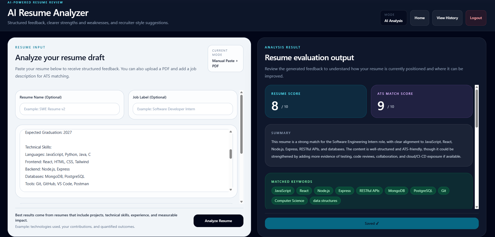

# 🚀 AI Resume Analyzer

AI-powered web application that analyzes resumes and provides ATS-style feedback, keyword matching, and improvement suggestions.

This project uses a React + Vite frontend with an Express.js backend, MongoDB persistence, and OpenAI-powered analysis.

---

## ✨ Features

* Analyze resume (paste text or upload PDF)
* ATS-style scoring and feedback
* Keyword match & missing keyword detection
* AI-generated improvement suggestions
* User authentication (JWT)
* Save, view, and delete past analyses
* Demo mode (no login required)

---

## 🏗️ Tech Stack

* **Frontend:** React, Vite, Tailwind CSS
* **Backend:** Node.js, Express.js
* **Database:** MongoDB + Mongoose
* **AI/NLP:** OpenAI API
* **Resume parsing:** PDF parsing via pdf-parse

---

## 📸 Screenshots

### 🚀 Landing Experience
<p align="center">
  
  
</p>

<p align="center">
  
</p>

### 🧠 Resume Analyzer
<p align="center">
  
</p>

### 📊 Results & Insights
<p align="center">
  
</p>

### 📌 Detailed Feedback
<p align="center">
  
  
</p>

---

## ⚙️ Setup (Local)

```bash
# Clone repo
git clone https://github.com/<your-user>/<your-repo>.git
cd AI-Resume-Analyzer-main
```

### Server

```powershell
cd server
npm install
```

Create a `.env` file in the `server` folder:

```env
PORT=5000
CLIENT_URL=http://localhost:5173
MONGODB_URI=mongodb://127.0.0.1:27017/resume-analyzer
JWT_SECRET=your_secret_key
OPENAI_API_KEY=your_openai_api_key
OPENAI_MODEL=gpt-4o-mini
```

Then start the backend:

```powershell
npm run dev
```

### Client

```powershell
cd client
npm install
copy .env.example .env
```

Then start the frontend:

```powershell
npm run dev
```

Use the default Vite URL:

```text
http://localhost:5173
```

---

## 🔐 Environment Variables

The app expects these values in `server/.env` and `client/.env`.

```env
# server/.env
PORT=5000
CLIENT_URL=http://localhost:5173
MONGODB_URI=mongodb://127.0.0.1:27017/resume-analyzer
JWT_SECRET=your_secret_key
OPENAI_API_KEY=your_openai_api_key
OPENAI_MODEL=gpt-4o-mini
```

```env
# client/.env
VITE_API_BASE_URL=http://localhost:5000
```

---

## 🧠 How It Works

```text
React/Vite → Express.js → MongoDB + OpenAI API
```

* Frontend sends resume data
* Backend validates and parses uploaded PDF files
* OpenAI generates structured ATS feedback
* Results can be saved to MongoDB

---

## 📌 Notes

* If `OPENAI_API_KEY` is missing, the analyzer endpoint returns an error instead of trying to guess.
* The API accepts pasted text and uploaded PDF files.
* The frontend should point to the backend via `VITE_API_BASE_URL`.

---

⭐ Star the repo if you found it useful!
